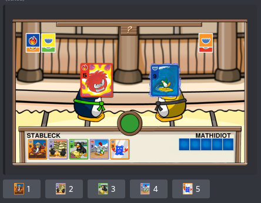
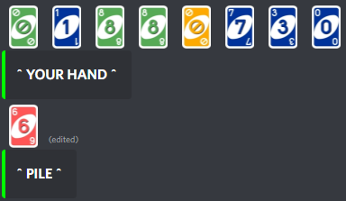

# Overview

This is a discord API that allows you to play card games with friends!

This was a project I wanted to do a while ago inspired by some friends of mine making card games in other languages.

I took on the challenge of making card jitsu from Club Penguin to start out with to see if I could get a simple yet complicated UI and standalone game that you can play online with friends.

The Bot can currently do the following:
```
    Has a help command that brings users to the documentation.
    
    Has a balance command to check your current balance.

    Has Daily, Weekly, and Monthly user claims to gain credits as you use the bot over time.

    You can start a game and it will create a server. Users can then look for the server using the proper commands and it will show all the servers with their given game code.

    When a user joins your game using /join (code), every player will be notified of the player joining the server.

    You can play a fully fledged out game online, cross server with friends of card-jitsu and uno, as well as in your Direct Messages.

    You can open card-packs for card-jitsu just like the good 'ol days and collect all the cards. You can view your deck, and even see how many cards you've collected and how many cards you need to collect from a given series.
```

An example of what Card-Jitsu looks like when playing looks like the following image.


You can see that you can select your choice using the buttons.
You can see what cards and colors you have won on, as well for the opponent.
It shows you the cards that were played for the round. (Although, no animations since these are images and not gifs)

---

The other game is UNO. Here's an example of the current looks of that.



The gameplay is similar to card-jitsu, however, it has not gotten a visual update yet, as it runs in multiple embeds. As of now the game is unplayable due to the rewrite, but is currently being worked on to be compatible with the new version of Discord.py v2.0.
This update will take a little bit longer than the Card-Jitsu visuals did, as this game can take anywhere from 2-8 players, which means that visuals will take longer to develop. As of now, Card-Jitsu is the only functional game being ran on the bot until further notice.

[Click Here for more proper documentation (currently outdated)](https://mathbotinc.glitch.me/)

[Software Demo Video (currently outdated)](https://youtu.be/YT4hVIMADyQ)

# Developent Environment
`SOFTWARE`
- Visual Studio Code
- Git
- Python
- MongoDB

`LIBRARIES`
- discord 
- asyncio
- pymongo
- datetime
- bs4 (beautiful soup)
- urllib
- opencv
- pillow

# Useful Websites

- [MongoDB](https://www.mongodb.com/)
- [Club Penguin Power Cards](https://clubpenguin.fandom.com/wiki/List_of_Card-Jitsu_Power_Cards)
- [Club Penguin Cards Series 1 - 4](https://clubpenguin.fandom.com/wiki/List_of_Regular_Card-Jitsu_Cards_(series_1-4))
- [Club Penguin Cards series 5 - 8](https://clubpenguin.fandom.com/wiki/List_of_Regular_Card-Jitsu_Cards_(series_5-8))
- [Standard Discord API Library](https://discordpy.readthedocs.io/en/stable/)

# Future Work

- Update Visuals for Uno just like card-jitsu
- More card games to be made. i.e. solitaire, gofish, blackjack, etc.
- Leveling up system to increase daily, weekly and monthly rewards.
